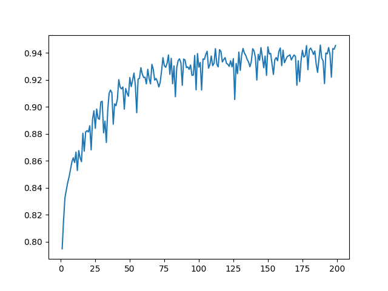
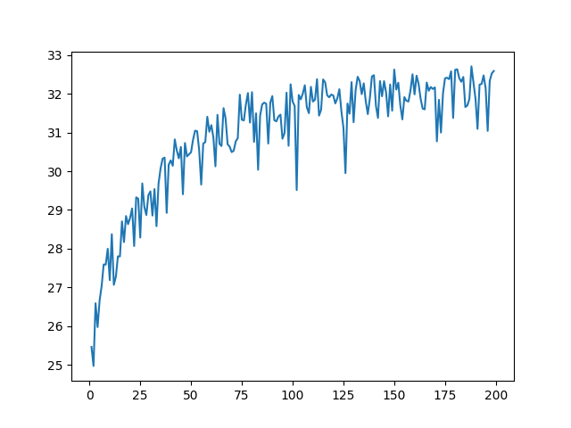
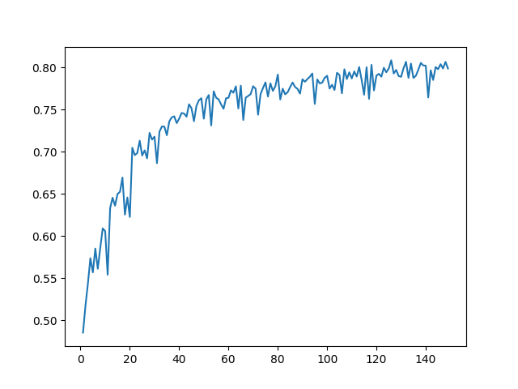
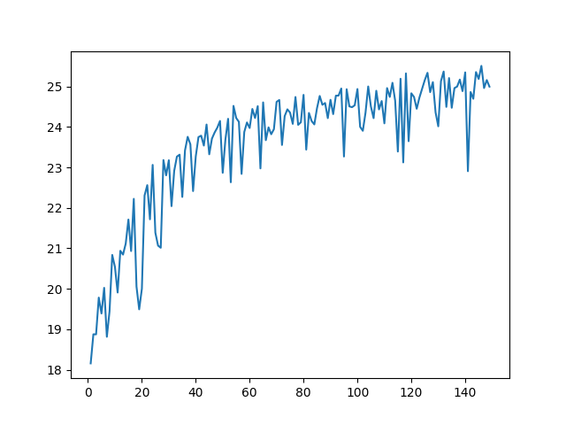
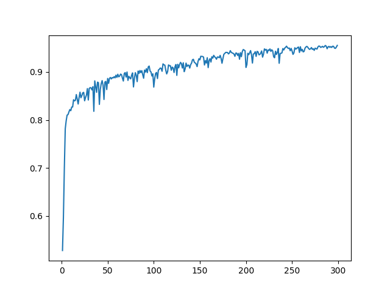
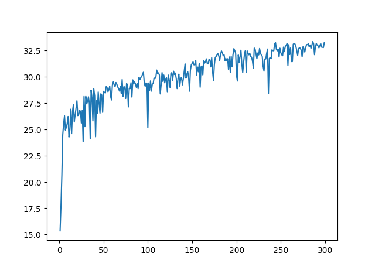
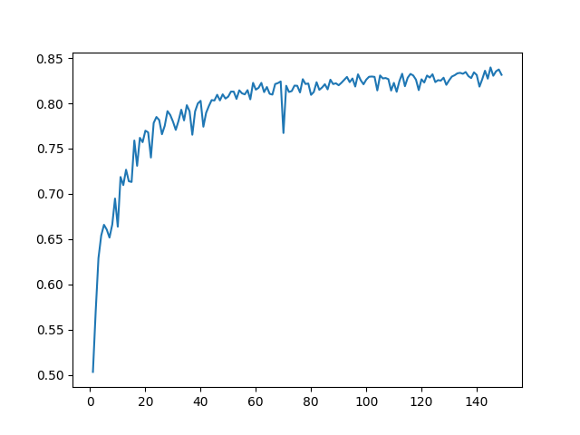
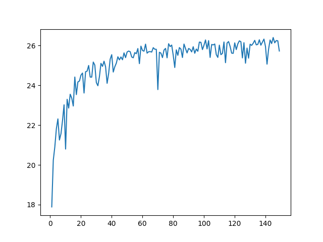

# Deep (Dilated) Convolutional Network for Deraining

## Installation

```bash
git clone https://github.com/KaneWANG0816/RR.git
```

### Packages
```bash
pip install -r requirements.txt
```
### Environment:

Python 3.8

CUDA 11.3

### For training data

Click [here](https://drive.google.com/file/d/1SPlNb19nmVCwLLdrzJnSrj-oJGGMMsxu/view?usp=sharing) to install datasets, including:
<ul>
  <li>Rain100L: 200 training pairs and 100 testing pairs</li>
  <li>Rain100H: 1800 training pairs and 200 testing pairs</li>
</ul>

p.s. <br>
Training section includes pre-generated rain mask.<br>
Decompress the 7z file and rename it to data.<br>
Place it in the root of this project.
## Usage

<b>Default using GPU</b>

[train.py](train.py) for training derain network

[test.py](test.py) for test batches of derain models<br>
p.s.

Please set or modify args before training or testing

### Try pre-trained derain model

[derain.py](derain.py) for test on derain samples

## Evaluatoin Results
###SSIM_Rain100L_RNet

###PSNR_Rain100L_RNet

<br>
<br>
###SSIM_Rain100H_RNet

###PSNR_Rain100H_RNet

<br>
<br>
###SSIM_Rain100L_RNet+

###PSNR_Rain100L_RNet+

<br>
<br>
###SSIM_Rain100H_RNet+

###PSNR_Rain100H_RNet+

<br>
<br>